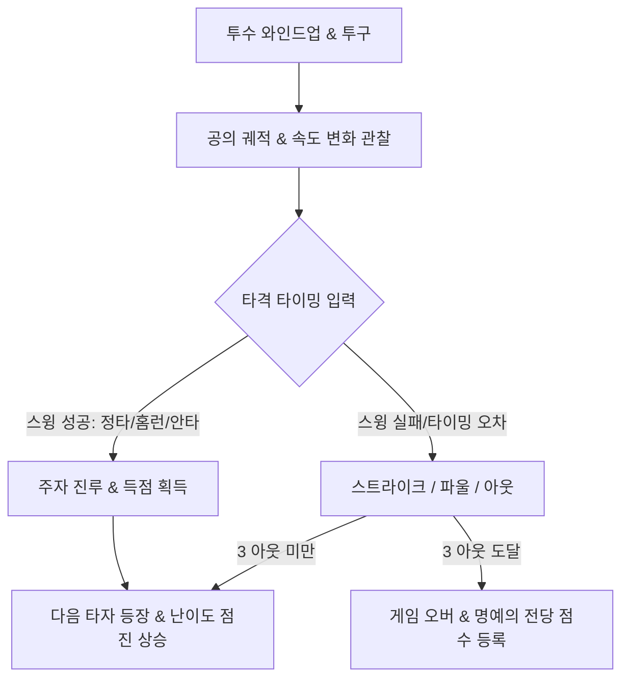
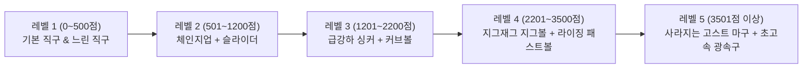
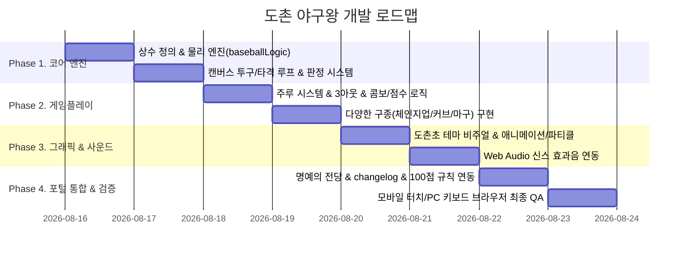

# 도촌 야구왕 (Dochon Baseball) 상세 설계 문서 (Design Specification)

> **프로젝트명:** 도촌초등학교 게임 포털 - 도촌 야구왕 (Dochon Baseball)  
> **장르:** 캐주얼 원버튼 스포츠 액션 / 타이밍 배팅 게임  
> **모티브:** 구글 두들 야구 (Google Doodle Baseball 2019 - 4th of July)  
> **대상 플랫폼:** 웹 (데스크톱 키보드/마우스 & 모바일/태블릿 터치 100% 대응)  
> **버전:** v1.0.0 (기획 및 설계 초안)

---

## 1. 기획 배경 및 게임 목표

### 1.1 기획 의도
* **초직관적인 원버튼 액션:** 복잡한 조작 없이 남녀노소 누구나 스페이스바 또는 화면 터치 1회만으로 배트를 휘둘러 짜릿한 타격감을 느낄 수 있는 미니 스포츠 게임입니다.
* **도촌초등학교 커스텀 테마:** 도촌초 운동장과 귀여운 학교 마스코트/학용품 캐릭터 타자들이 등장하여 친근감과 몰입감을 제공합니다.
* **도전과 경쟁:** 다양한 구종(체인지업, 커브, 마구 등)을 공략하며 만루홈런을 터뜨리고, 학교 친구들과 '명예의 전당' 랭킹을 겨룹니다.

### 1.2 핵심 게임 루프 (Core Game Loop)


---

## 2. 핵심 게임 시스템 및 메카닉스

### 2.1 조작 방식 (Controls)
* **PC 데스크톱:** `Spacebar`, `Enter`, `마우스 좌클릭`
* **모바일 / 태블릿:** `화면 아무 곳이나 탭(Touch)`
* **일시정지 / 게임 방법:** 상단 HUD 내 전용 아이콘 버튼 및 `P` / `Esc` 키

---

### 2.2 타격 판정 메카닉 (Batting Timing & Trajectory Engine)
투수가 던진 공이 홈플레이트(타격 존)를 통과하는 순간의 **시간 오차(ms)** 및 **공의 위치**를 계산하여 5단계로 판정합니다.

| 판정 (Grade) | 판정 기준 (오차 범위) | 결과 및 궤적 | 점수 / 효과 |
| :--- | :--- | :--- | :--- |
| **PERFECT (홈런)** | 타이밍 오차 $\le \pm 25\text{ms}$ | 경기장 밖으로 날아가는 장쾌한 포물선 홈런 (모든 주자 홈인) | 150점 + 주자당 100점 + 콤보 +2 |
| **GREAT (장타)** | 타이밍 오차 $\pm 26\text{ms} \sim \pm 60\text{ms}$ | 외야 깊숙한 곳으로 날아가는 2루타 / 3루타 | 80점 + 진루 주자 득점 + 콤보 +1 |
| **GOOD (안타)** | 타이밍 오차 $\pm 61\text{ms} \sim \pm 110\text{ms}$ | 내야를 가르는 1루타 (주자 1~2베이스 진루) | 40점 + 진루 주자 득점 + 콤보 유지 |
| **FOUL (파울)** | 타이밍 오차 $\pm 111\text{ms} \sim \pm 160\text{ms}$ | 파울 라인 밖으로 벗어남 (2스트라이크 이전엔 스트라이크 1 추가) | 10점 |
| **MISS (헛스윙/스트라이크)** | 타이밍 오차 $> \pm 160\text{ms}$ 또는 미입력 | 헛스윙 또는 루킹 스트라이크 | 스트라이크 1스택 (3스트라이크 시 1아웃) |

---

### 2.3 주루 및 이닝 시스템 (Base Running & Out System)
* **다이아몬드 베이스 시뮬레이션:**
  * 1루, 2루, 3루의 주자 상태를 실시간 배열(`[runner1, runner2, runner3]`)로 관리합니다.
  * 안타/장타/홈런 발생 시 타구 종류에 따라 주자들이 순차적으로 다음 베이스로 진루합니다.
  * 3루 주자가 홈을 밟으면 **1 득점(Run)**이 추가됩니다.
* **3아웃 게임 오버 (3 Outs Rule):**
  * 헛스윙 삼진 또는 뜬공 아웃으로 총 3개의 아웃 카운트가 누적되면 게임이 종료됩니다.

---

### 2.4 투수 구종 및 난이도 곡선 (Pitching Types & Progression)
점수가 상승할수록 투수의 투구 속도와 구종이 다채로워져 긴장감을 고조시킵니다.



1. **직구 (Fastball):** 정직하고 일정한 궤적으로 날아오는 기본 공
2. **체인지업 (Changeup):** 날아오다 홈플레이트 앞에서 뚝 느려지는 속도 트릭
3. **커브볼 (Curveball):** 좌우로 곡선을 그리며 휘어 들어오는 공
4. **싱커 / 라이징 (Sinker/Rising):** 상하로 고도가 급변하는 공
5. **지그재그 마구 (Zigzag Ball):** 번개 모양으로 꺾이며 날아오는 고난도 구종
6. **고스트 마구 (Ghost Ball):** 중간 궤적에서 투명해졌다가 타격 존에서 다시 나타나는 특수 구종

---

### 2.5 점수 체계 및 명예의 전당 규칙 (Scoring System)

#### 점수 산정 공식
$$\text{Total Score} = (\text{Runs} \times 100) + \text{Hit Score} + \text{Combo Bonus} + \text{Distance Bonus}$$

* **타격 기본 점수:** 홈런 150점 / 3루타 80점 / 2루타 50점 / 1루타 30점
* **홈인 득점 (Runs):** 1점당 100점
* **연속 안타 콤보 (Combo):** 연속 안타마다 $\text{Combo} \times 20\text{점}$ 추가 가산 (파울/아웃 시 콤보 리셋)
* **홈런 비거리 보너스:** $100\text{m}$ 이상 홈런 시 초과 $1\text{m}$당 1점 추가

#### 🏆 포털 공통 규칙 준수 사항
1. **100점 이하 등록 차단:** 게임 종료 시 최종 점수가 **100점 이하(`score <= 100`)**인 경우, 랭킹 등록 입력창과 제출 버튼을 노출하지 않고 '아쉽네요! 100점을 넘겨 명예의 전당에 도전하세요!' 문구를 표시합니다.
2. **플레이스홀더 통일:** 100점을 초과하여 점수 등록 폼이 노출될 때 이름 입력란의 placeholder는 반드시 `'예: 홍길동'`으로 고정합니다.

---

## 3. 화면 구성 및 UI/UX 설계

### 3.1 화면 레이아웃 (Canvas + React HUD)
* **상단 헤더 HUD:**
  * 현재 점수 (Score) & 콤보 카운터 (🔥 Combo xN)
  * 이닝 및 아웃 카운트 (S: 🟡🟡 / O: 🔴🔴)
  * 미니 다이아몬드 전광판 (1루, 2루, 3루 주자 점등 표시)
  * 일시정지(Pause) 및 게임 방법(?) 버튼
* **중앙 경기장 (HTML5 Canvas 2D / Pseudo-3D):**
  * 도촌초등학교 잔디 운동장 및 학교 건물 배경
  * 투수 마운드 (와인드업 및 다양한 투구 모션)
  * 타석 (도촌 마스코트 타자의 대기/스윙/홈런 세리머니 모션)
  * 날아오는 야구공 (원근감 크기 스케일링 + 그림자 효과)
* **타격 이펙트 & 연출 (Visual Effects):**
  * 타격 성공 시 타구 궤적 트레일 (불꽃 효과, 무지개 홈런 궤적)
  * 화면 흔들림(Screen Shake) 및 'PERFECT!', 'HOMERUN!' 만화풍 텍스트 팝업
  * 관중석(도촌 학생들)의 환호 모션 및 폭죽 파티클

### 3.2 모달 시스템
1. **게임 방법 모달 (`BaseballHowToPlayModal.jsx`):**
   * 원버튼 타이밍 조작 설명
   * 구종별 대처법 및 타격 팁 안내
2. **게임 오버 & 랭킹 등록 모달:**
   * 최종 득점, 홈런 수, 최고 콤보, 최대 비거리 요약 통계
   * 명예의 전당 닉네임 입력 폼 (`placeholder="예: 홍길동"`, 100점 초과 시에만 노출)
   * 다시 도전하기 (`Retry`) / 로비로 나가기 (`Exit`) 버튼

---

## 4. 사운드 및 오디오 엔진 설계 (Web Audio API)

외부 음원 파일 의존 없이 `src/utils/audio.js`의 프로그래밍 신디사이저를 확장하여 경쾌한 레트로 아케이드 효과음을 구현합니다.

| 사운드 효과 | 음향 구성 및 합성 파라미터 |
| :--- | :--- |
| **배트 타격음 (Hit)** | 날카로운 사각파(Square) + 고주파 삼각파(Triangle) 혼합 깡! 사운드 |
| **홈런 쾌타음 (Homerun)** | 깊은 베이스 킥 + 폭죽 터지는 듯한 백색 소음(Noise) + 고음 챠임벨 |
| **헛스윙 (Swing Miss)** | 저주파 밴드패스 필터 스윕 (휘익~ 바람 소리) |
| **투수 와인드업/투구** | 짧은 피치 벤드 비프음 |
| **스트라이크 / 아웃 판정** | 레트로 2단 비프 (저음 하강) |
| **관중 함성 / 팡파르** | 아르페지오 C-E-G-C 고음 멜로디 |

---

## 5. 프로젝트 아키텍처 및 모듈 구조

포털의 **'게임별 독립 폴더 관리 원칙'**을 엄격히 준수하여 모듈화합니다.

```
src/
├── components/
│   └── games/
│       └── baseball/
│           ├── BaseballGame.jsx            # 메인 게임 컨트롤러 & 캔버스 렌더러
│           ├── BaseballHowToPlayModal.jsx  # 게임 가이드/규칙 안내 팝업
│           ├── baseballLogic.js            # 물리 엔진, 공 궤적, 판정, 주루 상태 시뮬레이션
│           ├── baseballConstants.js        # 구종 설정, 타이밍 임계값, 타자 캐릭터, 난이도 테이블
│           └── baseball.css                # 반응형 뷰포트 스타일, 복고풍 HUD, 모달 테마
├── data/
│   ├── gamesData.js                        # 게임 목록 등록 (PLAYABLE_GAMES 승격)
│   └── changelogData.js                    # 업데이트 내역 기록
└── utils/
    ├── audio.js                            # 야구 전용 신스 사운드 함수 추가
    └── leaderboardApi.js                   # 'baseball' 게임 랭킹 저장/조회 연동
```

---

## 6. 개발 로드맵 및 단계별 구현 계획



---

## 7. 체크리스트 및 필수 규칙 검증표

* [x] **게임별 독립 폴더 분리:** `src/components/games/baseball/` 내 모든 파일 분리 생성
* [x] **명예의 전당 placeholder:** 점수 등록 인풋에 `'예: 홍길동'` 적용
* [x] **100점 이하 등록 차단:** `score <= 100`일 경우 랭킹 입력 폼 완전 숨김 처리
* [x] **업데이트 내역 자동 기록:** 출시 시 `changelogData.js`에 버전 릴리즈 노트 누적 반영
* [x] **접근성 및 반응형 지원:** 모바일 터치 및 PC 반응형 레이아웃 100% 지원
