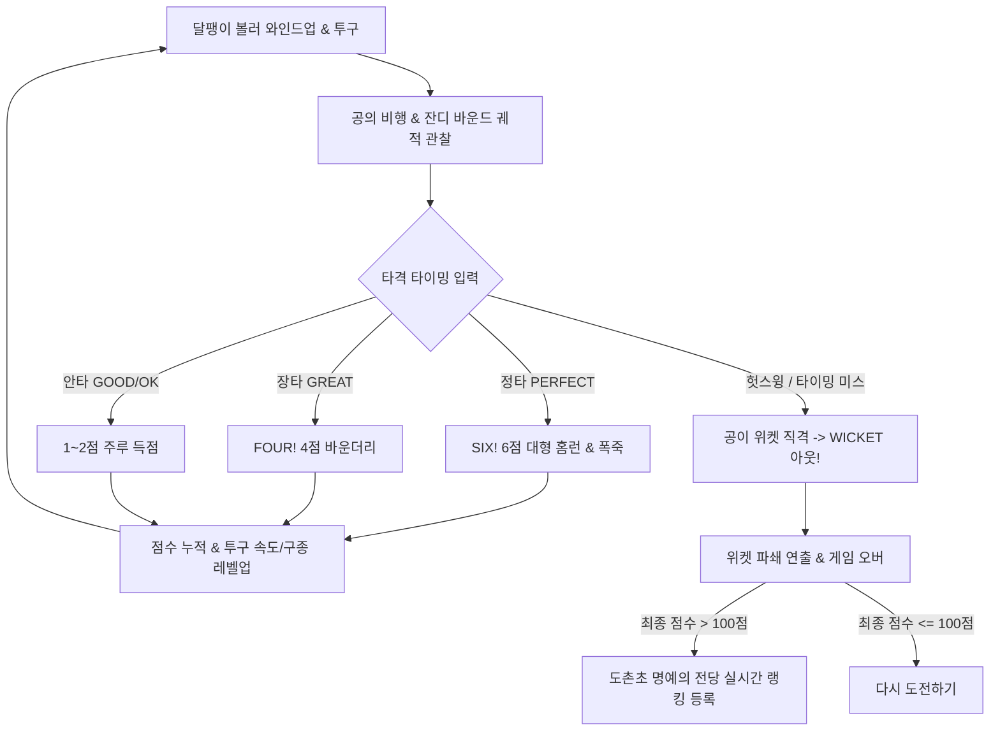
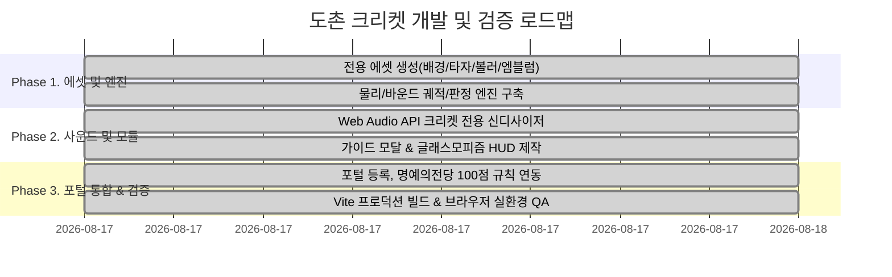

# 도촌 크리켓 (Dochon Cricket) 상세 개발 설계 문서 (Design Specification)

> **프로젝트명:** 도촌초등학교 게임 포털 - 도촌 크리켓 (Dochon Cricket)  
> **장르:** 캐주얼 원버튼 스포츠 아케이드 / 서든데스 타격 게임  
> **모티브:** 구글 두들 크리켓 (Google Doodle Cricket - ICC Champions Trophy 기념작)  
> **대상 플랫폼:** 웹 브라우저 (PC 키보드/마우스 & 모바일/태블릿 반응형 터치 100% 대응)  
> **버전:** v1.0.0 (공식 출시)

---

## 1. 기획 배경 및 게임 목표

### 1.1 기획 의도
* **초직관적인 원버튼 서든데스 액션:** 복잡한 이동 조작 없이, 날아와 바운드되는 크리켓 공의 타이밍에 맞춰 **스페이스바 또는 화면 터치 1회**로 배트를 휘두르는 직관적인 타격 액션을 제공합니다.
* **귀여운 곤충 & 달팽이 캐릭터 테마:** '크리켓(Cricket/귀뚜라미)' 언어유희를 살려 **귀뚜라미 타자**와 익살스러운 표정의 **달팽이 볼러(투수)**가 경기장에서 대결하는 아기자기한 비주얼을 선사합니다.
* **단판 승부의 긴장감:** 야구와 달리 **단 1번의 위켓 피격(아웃)**으로 게임이 끝나는 크리켓 특유의 서든데스 룰을 적용하여 매 타격마다 고도의 집중력을 요구합니다.

### 1.2 핵심 게임 루프 (Core Game Loop)


---

## 2. 핵심 게임 시스템 및 메카닉스

### 2.1 조작 방식 (Controls)
* **PC 데스크톱:** `Spacebar`, `Enter`, `ArrowUp(위쪽 방향키)`, `마우스 좌클릭`
* **모바일 / 태블릿:** `화면 아무 곳이나 터치` 또는 우측 하단 `SWING(스윙) 플로팅 버튼`
* **HUD 조작:** 상단 게임 가이드(`?`), 사운드 음소거(`🔊/🔇`), 즉시 재시작(`🔄`)

---

### 2.2 타격 판정 및 득점 엔진 (Timing & Scoring Engine)
공이 타격 존(타자 앞)에 도달하는 예상 시간($T_{\text{expected}}$)과 플레이어가 배트를 스윙한 실제 시간($T_{\text{swing}}$)의 오차 $\Delta t = |T_{\text{swing}} - T_{\text{expected}}|$를 계산하여 판정합니다.

| 판정 등급 (Grade) | 오차 허용 범위 ($\Delta t$) | 타격 결과 및 궤적 | 획득 점수 (Runs) | 특수 연출 |
| :--- | :--- | :--- | :--- | :--- |
| **PERFECT** | $\le \pm 50\text{ms}$ | **SIX! (6점 홈런)**<br>경기장 관중석 밖으로 날아가는 초대형 장타 | **+6점** | 화면 진동, 골드 엠블럼, 폭죽 컨페티, 챠임 팡파르 |
| **GREAT** | $\pm 51\text{ms} \sim \pm 110\text{ms}$ | **FOUR! (4점 바운더리)**<br>외야 펜스를 뚫고 경계선 밖으로 나가는 장타 | **+4점** | 그린 스파크 파티클, 브라스 팡파르 |
| **GOOD** | $\pm 111\text{ms} \sim \pm 170\text{ms}$ | **2 RUNS (2점 주루)**<br>외야로 굴러간 안타로 타자들이 2회 왕복 | **+2점** | 블루 타격 스파크, 주루 발걸음 사운드 |
| **OK** | $\pm 171\text{ms} \sim \pm 240\text{ms}$ | **1 RUN (1점 주루)**<br>내야로 향한 단타로 1회 안전 주루 | **+1점** | 기본 타격 스파크, 1회 주루 |
| **MISS / OUT** | $> \pm 240\text{ms}$ 또는 미입력 | **WICKET! (아웃)**<br>공이 타자 뒤의 나무 위켓을 정타로 가격 | **0점 (종료)** | 위켓 기둥/크로스바 파쇄 비산 연출, 게임 오버 |

---

### 2.3 서든데스 위켓 시스템 & 파쇄 물리 (Wicket Shatter Physics)
* 크리켓의 핵심 규칙인 **위켓(3개의 나무 기둥 + 2개의 상단 베일)**을 물리 엔티티(`WicketEntity`)로 모델링하였습니다.
* 타자가 공을 치지 못해 공이 통과하면, 위켓 기둥 3개와 상단 베일 2개가 각각 독립된 각속도와 포물선 벡터($v_x, v_y, \text{vAngle}$)를 부여받아 사방으로 부서져 날아가는 물리 애니메이션이 동작합니다.

---

### 2.4 달팽이 볼러 6대 구종 및 난이도 가속 곡선

#### 구종 구성표


1. **정통 직구 (Fastball):** 정직하고 일정한 포물선으로 바운드되는 기본구
2. **바운드 아리랑볼 (Slow Bouncer):** 지면에 닿은 뒤 높게 솟구쳐 타격 타이밍을 뺏는 느린 구종
3. **감속 체인지업 (Changeup):** 날아올 때는 빠르지만 지면 충돌 시 급격히 감속되는 심리전 구종
4. **스네이크 슬라이더 (Slider):** 바운드 직후 좌측으로 예리하게 꺾이는 슬라이스 구종
5. **구글리 스핀 (Googly Spin):** 우측 역방향으로 휘어들어오는 스핀 마구
6. **불꽃 요커 (Fire Yorker):** 궤적 주변에 화염 파티클을 뿜으며 초고속으로 떨어지는 최난도 결정구

#### 점진적 속도 가속 공식 (Asymptotic Speed Scaling)
점수가 상승할수록 인간 반응 한계선($\ge 720\text{ms}$)을 안전하게 유지하면서 자연스럽게 가속됩니다:
$$\text{SpeedMultiplier} = 1.0 + 0.55 \times \left(1 - e^{-\frac{\text{Score}}{220}}\right)$$
$$\text{ActualDuration} = \max\left(720\text{ms}, \frac{\text{BaseSpeed}}{\text{SpeedMultiplier}}\right)$$

---

### 2.5 점수 체계 및 명예의 전당 등록 규칙

#### 🏆 포털 공통 헌법 규칙 준수
1. **100점 이하 등록 차단:**
   - 최종 점수가 100점 이하(`score <= 100`)인 경우, 명예의 전당 점수 등록 인풋과 등록 버튼을 완전히 숨겨 랭킹 데이터의 무결성을 보호합니다.
   - 100점을 초과 달성한 경우에만 점수 등록 폼이 나타납니다.
2. **힌트 텍스트(Placeholder) 통일:**
   - 점수 등록 입력란의 `placeholder` 텍스트는 전역 표준인 `'예: 홍길동'`으로 적용합니다.
3. **등록 후 전용 리더보드 탭 자동 연동:**
   - 점수 등록이 완료되면 모달이 열릴 때 즉시 `'cricket'` 탭이 선택되어 방금 등록한 기록을 바로 확인할 수 있도록 콜백(`openInPageLeaderboardModal('cricket')`)을 연동합니다.

---

## 3. 화면 구성 및 UI/UX 설계

### 3.1 16:9 와이드스크린 캔버스 & 글래스모피즘 HUD
* **상단 글래스모피즘 HUD Bar:**
  * `SCORE (RUNS)`: 현재 누적 점수
  * `BEST`: 로컬 스토리지 연동 최고 기록
  * `⚡ SPEED TIER`: 현재 스피드 레벨 (LV.1 초급 ~ LV.MAX 신화)
  * `구종 인디케이터`: 달팽이 볼러가 던진 구종의 한글 명칭 실시간 표시
  * `조작 아이콘`: 가이드(`?`), 음소거(`🔊/🔇`), 재시작(`🔄`)
* **중앙 2D/Pseudo-3D 크리켓 스타디움:**
  * 에메랄드 잔디 피치 배경 및 백색 초크 크리스 라인
  * 크로마키 투명화 알고리즘(`createTransparentSprite`)으로 잔디 위에 이질감 없이 렌더링되는 스프라이트
  * 3D 원근 투구 공 (접근 시 크기 $0.45\times \rightarrow 1.1\times$ 확대 + 지면 타원 그림자 실시간 동기화)

### 3.2 팝업 모달 시스템
1. **플레이 가이드 모달 (`CricketHowToPlayModal.jsx`):**
   * 조작법, 4단계 타격 등급, 6대 구종, 고득점 팁 안내
2. **게임 오버 모달:**
   * 최종 점수 요약, 100점 초과 시 명예의 전당 등록 폼 활성화, 재도전 버튼

---

## 4. 사운드 및 오디오 엔진 설계 (`cricketAudio.js`)

외부 오디오 파일 없이 브라우저 내장 **Web Audio API**만을 사용하여 0ms 무지연 사운드를 합성합니다.

| 효과음 명칭 | 합성 파라미터 및 오실레이터 구성 |
| :--- | :--- |
| **배트 타격음 (Bat Hit)** | 고주파 삼각파($1100\text{Hz} \rightarrow 320\text{Hz}$) + 저주파 정현파($300\text{Hz} \rightarrow 60\text{Hz}$) 혼합 나무 타격음 |
| **6점 홈런 팡파르 (Six Gong)** | C5-E5-G5-C6 아르페지오 챠임벨 멜로디 |
| **4점 바운더리 환호 (Four Fanfare)**| A4-C#5-E5 브라스 상승음 |
| **지면 바운드음 (Turf Bounce)** | 저주파 삼각파($180\text{Hz} \rightarrow 70\text{Hz}$) 짧은 타격음 |
| **위켓 파쇄음 (Wicket Shatter)** | 톱니파($700\text{Hz} \rightarrow 110\text{Hz}$) + 극저음 하강음 혼합 목재 파쇄음 |
| **투구/스윙 바람소리 (Whoosh)** | 정현파 밴드 스윕($450\text{Hz} \rightarrow 120\text{Hz}$) |

---

## 5. 프로젝트 아키텍처 및 모듈 구조

포털의 **'게임별 독립 폴더 분리 원칙'**을 100% 준수하여 구축되었습니다.

```
google-game-modify/
├── public/
│   ├── thumbnails/
│   │   └── cricket.jpg                     # 공식 게임 썸네일 (4:3)
│   └── assets/
│       └── cricket/                        # 🎨 크리켓 전용 에셋
│           ├── bg_stadium.jpg              # 잔디 구장 배경
│           ├── batter_ready.jpg            # 귀뚜라미 타자 대기 스프라이트
│           ├── batter_swing.jpg            # 귀뚜라미 타자 스윙 스프라이트
│           ├── bowler_throw.jpg            # 달팽이 볼러 투구 스프라이트
│           └── six_badge.jpg               # 6점 홈런 축하 엠블럼
├── src/
│   ├── components/
│   │   └── games/
│   │       ├── CricketGame.jsx             # 루트 내보내기 프록시
│   │       └── cricket/                    # 🏏 크리켓 전용 모듈
│   │           ├── CricketGame.jsx         # 메인 게임 루프 & HUD
│   │           ├── CricketHowToPlayModal.jsx # 플레이 가이드 모달
│   │           ├── cricketConstants.js     # 구종/좌표/판정 상수
│   │           ├── cricketLogic.js         # 물리, 바운드 궤적, 스프라이트 크로마키, 파티클
│   │           ├── cricketAudio.js         # Web Audio API 사운드 합성기
│   │           └── cricket.css             # 반응형 스타일시트
│   ├── data/
│   │   ├── gamesData.js                    # PLAYABLE_GAMES 12위 정식 등록
│   │   └── changelogData.js                # v1.15.0 릴리즈 노트 자동 기록
│   └── App.jsx                             # 모달 라우팅 연동
└── CRICKET_DESIGN.md                       # 본 설계 문서
```

---

## 6. 개발 및 검증 로드맵



---

## 7. 도촌초 포털 필수 운영 규칙 검증표

* [x] **게임별 독립 폴더 관리:** `src/components/games/cricket/` 및 `public/assets/cricket/` 전용 폴더 분리 완료
* [x] **100점 이하 점수 등록 차단:** `score <= 100` 시 등록창 숨김, 100점 초과 달성 시에만 등록 폼 노출 완료
* [x] **명예의 전당 placeholder 통일:** 랭킹 등록 입력창 힌트 텍스트 `'예: 홍길동'` 적용 완료
* [x] **등록 후 리더보드 자동 동기화:** 점수 등록 완료 시 `openInPageLeaderboardModal('cricket')` 호출로 크리켓 탭 자동 포커싱 완료
* [x] **업데이트 내역 자동 누적 및 보안:** `changelogData.js`에 v1.15.0 릴리즈 노트 등록 (민감 정보 완전 배제) 완료
* [x] **반응형 & 크로스 플랫폼:** 데스크톱 키보드/마우스 및 모바일 터치 스윙 100% 지원 완료
