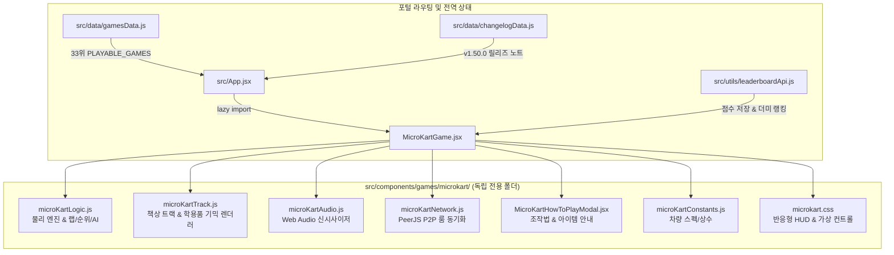

# [신규 게임 개발] 도촌 마이크로 카트 레이싱 (Dochon Micro Kart Racing) 구현 계획서

교실 책상과 학용품(연필, 자, 지우개, 모눈종이 등)을 서킷으로 활용한 실시간 탑뷰(Top-Down) 아케이드 카트 레이싱 게임 **'도촌 마이크로 카트 레이싱'**을 개발하여 도촌초등학교 게임 포털의 33번째 공식 플레이어블 게임으로 정식 출시합니다.

---

## 📌 주요 특징 및 핵심 설계

1. **테마 & 비주얼**:
   - 교실 책상의 나무 결, 공책/모눈종이 도로, 연필/지우개 가드레일, 삼각자 지름길, 물감 슬라임 장애물 등 초등학생 눈높이에 맞춘 아기자기한 데스크탑 서킷.
   - 캔버스 2D 기반의 부드러운 60FPS 애니메이션 및 플레이어 카트를 중심에 두는 부드러운 카메라 추적(Camera Follow Viewport) 시스템.

2. **조작감 및 주행 물리**:
   - 가속, 감속/후진, 부드러운 회전 각속도, 마찰력 및 드리프트(타이어 스키드 마크 + 미니 부스터 게이지 충전) 물리 엔진 구현.
   - PC 키보드(방향키/WASD, Space 드리프트, Shift/Ctrl 아이템) 및 모바일/태블릿 가상 조이스틱 & 터치 버튼 지원.

3. **아이템 배틀 시스템**:
   - 🍌 **바나나 껍질**: 후방 투하, 밟은 카트는 360도 스핀 및 일시적 감속.
   - 💧 **물풍선**: 전방 조준 발사, 상대 카트를 가두어 잠시 띄우고 정지.
   - 🚀 **로켓 연필**: 직선 고속 발사 미사일, 직격 시 폭발 및 넉백.
   - 💨 **미니 부스터(니트로)**: 1.5배 순간 가속 및 부스터 이펙트.
   - 🛡️ **자석 실드**: 1회 아이템 공격 무효화 방어막.

4. **게임 모드**:
   - 🏎️ **솔로 모드**: 난이도 조절이 가능한 똑똑한 AI 레이서 봇 3~5대와의 3랩(Lap) 쟁탈전.
   - 👥 **실시간 P2P 멀티플레이**: PeerJS 기반 4자리 숫자 방 코드로 친구들과 즉석에서 방을 만들어 최대 4인 동시 레이스.

5. **포털 연동 및 명예의 전당**:
   - 순위 점수 + 완주 시간 보너스 + 드리프트 성공 보너스 + 아이템 적중 점수 합산.
   - **100점 이하 점수 등록 차단**, **힌트 텍스트 `'예: 홍길동'`**, **등록 후 리더보드 자동 탭 선택** 등 프로젝트 전역 메모리 규칙 100% 준수.

---

## 🏗️ 시스템 아키텍처 다이어그램

---

## 📋 프로젝트 전역 규칙 준수 검토 (Global Constraints)

- **게임별 독립 폴더 관리 원칙**: 모든 컴포넌트, 로직, 스타일, 오디오, 트랙 코드를 `src/components/games/microkart/` 폴더 내에 100% 독립적으로 구성.
- **명예의 전당 점수 기록 힌트 텍스트**: 점수 등록창 `placeholder`는 반드시 `'예: 홍길동'`으로 작성.
- **100점 이하 점수 등록 차단 원칙**: `finalScore <= 100`인 경우 점수 등록 폼 및 버튼 숨김 처리.
- **점수 등록 후 해당 게임 리더보드 자동 선택**: 등록 완료 시 `onScoreSubmitted('microkart')`를 호출하여 리더보드 모달에서 `microkart` 탭이 즉시 열리도록 처리.
- **업데이트 내역 자동 기록 및 보안 원칙**: `src/data/changelogData.js`에 `v1.50.0` 업데이트 내역을 추가하되, 관리자 모드/비밀번호 등 민감 정보는 철저히 배제.
