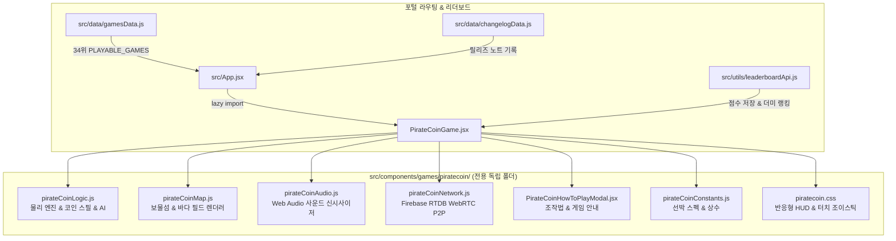

# [신규 게임 개발] 도촌 해적선 코인 쟁탈전 (Dochon Pirate Coin Heist) 구현 계획서

보물섬에 쏟아지는 금화를 모아 자신의 해적선으로 안전하게 수송하고, 상대 배를 들이받아 코인을 털어내는 실시간 P2P 배틀 아케이드 게임 **'도촌 해적선 코인 쟁탈전'**을 개발하여 도촌초등학교 게임 포털의 34번째 공식 플레이어블 게임으로 정식 출시합니다.

---

## 📌 1. 핵심 게임 기획 및 플레이 메커니즘

1. **테마 & 전장 (Sea & Treasure Island Arena)**:
   - 중앙에 위치한 거대한 **황금 보물섬**: 주기적으로 금화(10점), 보물상자(50점), 저주받은 해골 코인이 쏟아져 나옴.
   - 사방의 4개 코너: 각 팀의 **홈 베이스 선착장(해적선)** (빨강 해적단, 파랑 해적단, 초록 해적단, 노랑 해적단).
   - 필드 기믹: 소용돌이(회전 넉백), 산호초/암초(충돌 장애물), 순풍 해류(순간 가속 레일).

2. **금화 수집 & 입금 시스템 (High Risk - High Return)**:
   - 바닥의 코인을 획득하면 배 뒤로 황금 자루/궤짝이 사슬처럼 길게 연결되어 따라다님 (시각적 만족감).
   - **무게 페널티**: 소지 코인 수(0~30개)에 따라 선박의 속도가 100%에서 최대 70%까지 점진적으로 둔화되어 리스크 증가.
   - **해적선 입금**: 자신의 홈 선착장으로 돌아오면 몸에 달린 코인이 영구 점수로 입금(`BANKED SCORE`)되어 안전하게 보존됨.

3. **들이받기 & 코인 강탈 (Ramming & Coin Spill)**:
   - 가속 돌진 상태로 상대 배를 들이받으면, 상대가 소지하고 있던 미입금 코인의 40~50%가 사방으로 튕겨져 나와 드롭됨!
   - 튕겨져 나온 코인은 누구나 즉시 주울 수 있어 치열한 코인 쟁탈 난투극 발생.

4. **해적 배틀 아이템 4종**:
   - 💣 **해적 대포알 (Cannonball)**: 전방 발사, 직격 시 상대 배를 1.5초간 스턴 및 코인 드롭.
   - 💨 **순풍 돛대 부스터 (Wind Boost)**: 2초간 1.6배 급가속하여 도주하거나 강력한 들이받기 시도.
   - 🧲 **황금 자석 (Coin Magnet)**: 3초간 일정 반경 내의 모든 금화를 끌어당김.
   - 🛡️ **크라켄 방패 (Kraken Shield)**: 1회 충돌이나 대포 공격을 튕겨내고 방어.

5. **게임 모드**:
   - ⚔️ **솔로 모드**: 3단계 난이도(초급/중급/해적왕)의 똑똑한 AI 해적선 봇 3척과의 90초 타이머 배틀.
   - 👥 **실시간 P2P 멀티플레이**:
     - 도촌초 전용 Firebase RTDB 기반 WebRTC 시그널링(`firebaseSignaling.js`) 연동.
     - 4자리 숫자 룸코드(예: `1234`, `8899`)로 초간편 방 생성/입장.
     - W3C 네이티브 `RTCDataChannel`을 통한 10ms 초저지연 P2P 동기화 및 0원 서버 트래픽.
     - 방 종료 시 Firebase RTDB 노드 즉시 삭제로 0-Byte 클린업.

---

## 🏗️ 2. 시스템 아키텍처 및 폴더 구조

`GEMINI.md`의 **'게임별 독립 폴더 관리 원칙'**에 따라 모든 소스 코드는 `src/components/games/piratecoin/` 폴더에 생성되어 100% 독립 격리됩니다.

```
src/components/games/piratecoin/
├── PirateCoinGame.jsx            # 메인 React 컴포넌트, 캔버스 뷰포트, 카메라 추적, HUD, 가상 컨트롤러
├── PirateCoinHowToPlayModal.jsx  # 조작법, 코인 입금 룰, 아이템 및 기믹 안내 모달
├── pirateCoinConstants.js        # 선박 4종 스펙, 전장 규격, 물리 파라미터, 스폰 확률, 랭킹 기준
├── pirateCoinMap.js              # 파도 텍스처, 보물섬, 암초, 4개 베이스 선착장 절차적 렌더러
├── pirateCoinLogic.js            # 선박 조향/가속/충돌 물리, 코인 체인 트레일, AI 봇 행동트리, 들이받기 판정
├── pirateCoinAudio.js            # Web Audio API 무에셋 신시사이저 (파도, 대포, 코인 짤랑, 입금 팡파레)
├── pirateCoinNetwork.js          # Firebase RTDB WebRTC 시그널링 + RTCDataChannel P2P 매니저
├── piratecoin.css                # 해적 테마 반응형 HUD, 미니맵 레이더, 모바일 터치 컨트롤 스타일
└── README.md                     # 게임 상세 명세 및 개발 문서
```



---

## 📋 3. 프로젝트 전역 규칙(Global Constraints) 철저 준수

1. **게임별 독립 폴더 관리 원칙**:
   - `src/components/games/piratecoin/` 내에서 모든 컴포넌트, 로직, 오디오, 맵, 스타일 완결.
2. **명예의 전당 점수 등록 힌트 텍스트**:
   - 점수 등록 인풋창의 placeholder는 반드시 `'예: 홍길동'`으로 통일.
3. **100점 이하 점수 등록 차단 원칙**:
   - 최종 획득 점수가 100점 이하(`finalScore <= 100`)인 경우 점수 등록 폼과 제출 버튼을 일체 숨김.
4. **점수 등록 후 리더보드 자동 탭 선택**:
   - 등록 완료 시 `onScoreSubmitted('piratecoin')` 호출로 '도촌초등학교 명예의 전당' 모달에서 `piratecoin` 탭 자동 활성화.
5. **업데이트 내역 교육 친화적 표현 & 보안 원칙**:
   - '학교 네트워크', '우회' 등의 단어 절대 금지 $\rightarrow$ '네트워크 연결 안정성 강화', 'P2P 다중 재연결 및 패킷 최적화' 표현 사용.
   - 비밀번호, 관리자 모드 관련 정보 배제.
6. **기존 썸네일 에셋 활용**:
   - 이미 준비되어 있는 `public/thumbnails/piratecoin.jpg` 에셋을 그대로 공식 썸네일로 연결.
